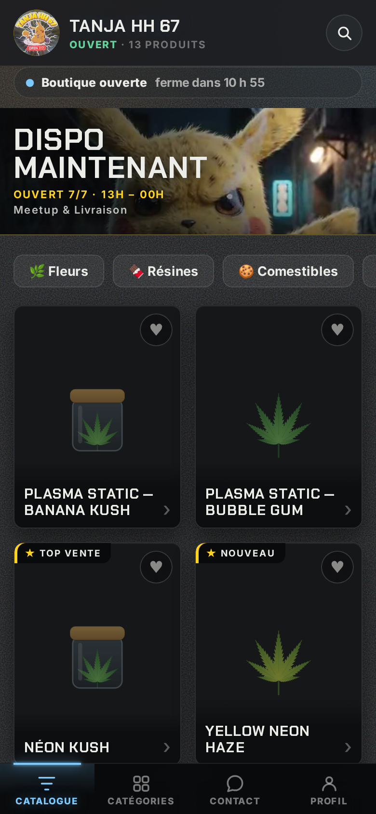
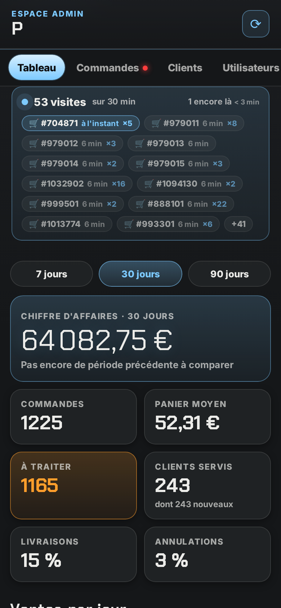

# ⚡ TANJA HH 67 — boutique Telegram Mini App

Une boutique qui s'ouvre directement dans Telegram : catalogue en images, fiches
produits, et un bouton **Commander** qui ouvre ta conversation avec le produit et
le format déjà écrits.

**Il n'y a pas de panier.** L'application sert à choisir — voir les produits,
comparer les formats, lire les avis — et la commande se passe entre le client et
toi, dans la conversation. Rien n'est enregistré côté boutique : ni référence, ni
décompte de stock automatique.



> **Note sur ce document.** Les sections ci-dessous — mise en route, espace
> admin, mise en ligne, sécurité — sont à jour. Plus bas, certaines pages
> décrivent encore le panier, les codes promo, les paliers de remise, les zones
> de livraison et les créneaux : ces mécanismes existent toujours côté serveur
> et dans l'espace admin, mais la boutique ne s'en sert plus depuis qu'on
> commande par la conversation. Rien n'a été supprimé, donc tout reste
> réactivable — mais ne cherche pas ces écrans dans l'application, ils n'y sont
> plus.

---

## Comment ça marche

```
Client → /start dans le bot → bouton « Ouvrir la boutique »
       → Mini App (catalogue, fiches, formats)
       → « Commander · 70 € »
       → ta conversation s'ouvre, message déjà écrit :
         « Bonjour ! Je voudrais commander sur TANJA HH 67 ⚡
           • Plasma Static — Banana Kush — 5 g — 70 € »
       → tu réponds, vous convenez du reste (quantité, remise en
         main propre ou livraison, heure) en conversation
```

---

## Mise en route

Trois étapes, dans cet ordre. Compter vingt minutes la première fois.

### 1. Créer le bot

1. Sur Telegram, écris à **[@BotFather](https://t.me/BotFather)**.
2. `/newbot` → choisis un nom, puis un identifiant qui finit par `bot`
   (`tanja_hh_67_bot`).
3. BotFather te donne un **token** du type `123456:ABC-DEF…` → garde-le secret,
   il donne le contrôle complet du bot.

### 2. Installer le projet

```bash
git clone https://github.com/Remaums/Tanjahh
cd Tanjahh
npm install
cp .env.example .env
```

`.env` n'existe pas avant cette copie : il contient tes secrets, il est donc
ignoré par git. Son nom commence par un point, donc **il est invisible** dans un
explorateur de fichiers tant que tu n'affiches pas les fichiers cachés (`ls -a`
en terminal).

Ouvre-le. Tout ce qui est propre à Tanja y est déjà juste ; **trois lignes** sont
à remplir, chacune marquée `À REMPLIR` :

| Variable | À quoi ça sert |
|---|---|
| `BOT_TOKEN` | Le token de BotFather. **Obligatoire même pour un simple aperçu** : il sert à vérifier la signature de Telegram, et le serveur refuse de démarrer sans lui |
| `ADMIN_CHAT_ID` | Ton identifiant Telegram, un nombre. C'est là que le bot dépose les alertes et les messages des clients |
| `ADMIN_IDS` | Qui peut ouvrir l'espace admin. Le même nombre, en général |

> Pour connaître ton identifiant : lance la boutique, envoie `/start` au bot, il
> te l'affiche.

Les autres lignes sont déjà remplies et méritent d'être comprises plutôt que
modifiées :

| Variable | Pourquoi c'est déjà juste |
|---|---|
| `SELLER_USERNAME=tanjahh67` | **La pièce maîtresse.** Sans panier, c'est cette conversation-là que « Commander » ouvre. Mal renseigné, plus rien ne se commande |
| `PORT=3100` | Et non 3000 : c'est ce qui permet de faire tourner deux boutiques sur la même machine |
| `WEBAPP_URL` | À remplir à l'étape 4, quand tu auras une adresse HTTPS |

### 3. Lancer

```bash
npm start
```

La boutique est servie sur `http://localhost:3100`, le bot démarre en parallèle.
Ouvre cette adresse dans un navigateur : tu dois voir le catalogue. Si oui, la
moitié du travail est faite — il ne reste qu'à la rendre joignable depuis un
téléphone.

### 4. Exposer en HTTPS

Telegram n'ouvre une Mini App que derrière une URL **HTTPS**. Pour tester depuis ton
téléphone sans déployer :

```bash
npm run public
```

Une seule commande : elle ouvre le tunnel, **affiche l'adresse seule**, l'inscrit
dans `WEBAPP_URL` et démarre la boutique — dans cet ordre, puisque la boutique lit
`.env` au démarrage. Envoie `/start` au bot : le bouton « Ouvrir la boutique »
apparaît.

`npm run tunnel` fait la même chose sans lancer la boutique, si elle tourne déjà
dans une autre fenêtre.

> **Installe `cloudflared` une fois, et ce sera instantané.** Sans lui, le script
> passe par `npx`, qui retélécharge quarante mégaoctets à chaque lancement — c'est
> là que part la minute d'attente.
>
> | | |
> |---|---|
> | Windows | `winget install Cloudflare.cloudflared` |
> | macOS | `brew install cloudflared` |
> | Linux | `sudo apt install cloudflared` |

**Ce tunnel-là est fait pour essayer, pas pour vendre.** L'adresse change à chaque
redémarrage, et tout s'arrête dès que tu fermes ton ordinateur. Pour que des
clients s'en servent, il faut que la boutique tourne en permanence quelque part :
voir **[docs/vps.md](docs/vps.md)**, qui va du VPS vide au bouton dans Telegram, et
`bash deploy/installer.sh` qui en exécute les étapes mécaniques.

### Les deux boutons qui ouvrent la boutique

| Où | Libellé | Couleur |
|---|---|---|
| Sous les messages du bot | `🛒 Ouvrir la boutique` | **rouge** (`style: "danger"`) |
| En bas à gauche du chat | le nom de la boutique + `⚡` | celle de Telegram, non réglable |

Le rouge est arrivé avec la **version 9.4 de l'API de Telegram**, en février
2026 : trois styles seulement — `danger` (rouge), `success` (vert),
`primary` (bleu). Avant cela, un emoji dans le libellé était tout ce qu'on
pouvait faire. Un style inventé fait refuser le message entier, comme une
mauvaise URL de Mini App.

Le libellé du bouton de menu vient des réglages et suit donc un changement
de nom. Il est borné à 64 caractères : au-delà Telegram refuse l'appel, et
le menu retomberait sur « Menu » sans que rien ne le dise.

### 5. Le bouton en bas à gauche du chat

**Rien à faire :** au démarrage, le bot pose lui-même le bouton de menu (en bas
à gauche de la conversation) pour qu'il **ouvre la boutique** — il remplace le
bouton « Menu » qui déroulait la liste des commandes. Le réglage suit toujours
`WEBAPP_URL`, sans manœuvre chez @BotFather ; si l'URL est absente ou n'est pas
en HTTPS, le menu par défaut est reposé plutôt qu'un lanceur que Telegram
refuserait d'ouvrir.

En mode webhook (serverless), c'est `node tools/set-webhook.mjs` qui le règle,
puisqu'il n'y a pas de démarrage de bot à ce moment-là.

---

## ⚙️ Espace admin

**Comment y entrer :** envoie `/admin` à ton bot dans Telegram. Il répond avec
un bouton **⚙️ Espace admin** qui ouvre le panneau. Deux conditions, et le bot
dit laquelle manque : ton identifiant numérique doit figurer dans `ADMIN_IDS`
(envoie `/start` au bot, il te l'affiche), et `WEBAPP_URL` doit être une
adresse en `https://` — Telegram n'ouvre pas une Mini App autrement.

L'adresse `…/admin.html` ouverte directement dans un navigateur ne sert à rien :
l'authentification repose sur la signature que Telegram fournit au lancement,
et elle n'existe qu'à l'intérieur de Telegram.




Envoie `/admin` au bot (réservé aux administrateurs — `ADMIN_IDS`, plus ceux
ajoutés avec `/addadmin`) : la
Mini App d'administration s'ouvre avec quatre onglets.

| Onglet | Ce que tu y fais |
|---|---|
| **Tableau** | Chiffre d'affaires total et du jour, nombre de commandes, commandes à traiter, meilleures ventes, alertes de stock bas |
| **Commandes** | Toutes les commandes, filtrables par statut, avec les boutons pour les faire avancer |
| **Stock** | Réglage direct des quantités, format par format, avec recherche |
| **Produits** | Créer, modifier, masquer ou supprimer un produit |

### Où mènent les commandes

Cette boutique ne prend pas la commande : elle amène le client au vendeur.
Le bouton **Commander** d'une fiche produit ouvre donc une conversation, et
**Réglages → Où mènent les commandes** décide laquelle.

| Champ *Compte Snapchat* | Ce que fait le bouton |
|---|---|
| rempli | ouvre `snapchat.com/add/<pseudo>` |
| vide | rouvre la conversation Telegram du vendeur, avec la commande écrite dedans |

Colle ce que tu as sous la main — le lien de partage que Snapchat te donne,
`@pseudo` ou le pseudo nu : les trois marchent. Seul le pseudo est gardé, et
le lien se refabrique à l'affichage.

> **Snapchat ne sait pas pré-remplir un message.** Telegram accepte `?text=`
> et dépose la phrase dans le champ de saisie ; aucun lien Snapchat public ne
> fait l'équivalent — `snapchat.com/add/…` ouvre la fiche du compte, et c'est
> tout ce qu'on peut viser. Le client arriverait donc devant un champ vide,
> à retaper de mémoire le nom exact du produit et son format, après avoir
> quitté la boutique.
>
> La boutique **copie donc la commande dans son presse-papier** avant de
> l'emmener : il lui reste un appui long pour la coller. Et quand la copie
> échoue — `navigator.clipboard` manque dans une partie des WebView de
> Telegram — elle ne fait pas semblant : elle le dit et nomme le compte.

Le compte apparaît aussi en clair sur l'écran **Contact**, sous les horaires.
Le message qui annonce la copie dure deux secondes ; sans cette ligne, un
client qui l'a laissé passer n'aurait plus aucun moyen de retrouver le compte
depuis la boutique.

Vider le champ remet tout comme avant. C'est le chemin du retour en arrière,
et il ne demande aucun redéploiement.

### Le cycle d'une commande

```
Nouvelle ──▶ Confirmée ──▶ Prête ──▶ Livrée
    │            │           │
    └────────────┴───────────┴──▶ Annulée   (le stock est remis en rayon)
```

Le client reçoit **automatiquement un message du bot** à chaque changement de statut.
Les transitions illégales sont refusées côté serveur : on ne passe pas de
« Nouvelle » directement à « Livrée ».

### Le stock

- Chaque produit a un stock ; s'il a des formats (2 g, 5 g…), le stock est tenu
  **par format**.
- Une commande **décrémente le stock en tout ou rien** : deux clients ne peuvent
  pas emporter le dernier article en même temps.
- Un produit épuisé apparaît **grisé et non commandable** dans la boutique, et
  le format épuisé est barré dans la fiche produit.
- Le tableau de bord signale tout ce qui descend **à 5 unités ou moins**.
- Annuler une commande **remet automatiquement les articles en rayon**.

---

## Personnaliser

### Les produits

Le plus simple est de passer par l'**espace admin** (`/admin` dans le bot) : tout se
modifie depuis le téléphone, sans toucher au code.

Au premier démarrage, le catalogue est créé dans `server/data/catalog.json` à partir
du catalogue d'exemple de **`server/data/products.js`**. Ensuite c'est le fichier JSON
qui fait foi. Pour repartir du catalogue d'exemple, supprime `catalog.json` et
redémarre. Une entrée ressemble à ça :

```js
{
  id: 'neon-kush',               // identifiant unique, sans espaces
  name: 'Néon Kush',
  category: 'fleurs',            // doit exister dans `categories`
  price: 1200,                   // EN CENTIMES : 1200 = 12,00 €
  image: '/assets/products/jar.svg',
  badge: 'TOP VENTE',            // pastille rose, optionnelle
  tags: ['Indica', 'Nuit'],
  short: 'Texte court affiché sur la vignette.',
  description: 'Texte long affiché dans la fiche produit.',
  stock: null,                   // null si le stock est porté par les variantes
  variants: [                    // optionnel : formats au choix
    { id: '2g', label: '2 g', price: 1200, stock: 24 },
    { id: '5g', label: '5 g', price: 2700, stock: 12 },
  ],
}
```

> ⚠️ Les prix sont **en centimes** pour éviter les erreurs d'arrondi, et ils sont
> systématiquement **recalculés côté serveur** : un client ne peut pas se commander
> un produit à 0 €.

### Mettre un produit en avant

La boutique présente le catalogue **dans l'ordre du panneau admin** — seuls
les articles épuisés passent en fin de liste. Choisir ce que le client voit
en premier, c'est donc remonter le produit dans cette liste.

Dans l'onglet **Produits**, le bouton **↕ Classer les produits** ouvre le
mode classement (**✓ Terminer le classement** pour en sortir). Chaque ligne reçoit alors trois flèches :

| | |
|---|---|
| **⤒** | en tête — le produit passe devant tous les autres |
| **↑** | d'un rang vers le haut |
| **↓** | d'un rang vers le bas |

Le produit en tête porte la mention **En avant**. Rien à valider : chaque
geste part aussitôt au serveur, et si celui-ci refuse, la liste revient
toute seule à ce qu'elle était — on ne reste jamais devant un ordre qui
n'existe que sur l'écran.

Le classement tient dans l'ordre du catalogue, pas dans une note posée sur
le produit : enregistrer une fiche, changer un prix ou un stock ne déplace
donc rien.

> Le serveur exige la liste **entière** du catalogue, et vérifie que c'est
> une permutation exacte : ni doublon, ni identifiant inconnu, ni produit
> manquant. Ce n'est pas de la pédanterie — avec deux onglets d'admin
> ouverts, ou un écran resté sur le catalogue d'avant-hier, une liste
> partielle ferait disparaître les produits qu'elle ne nomme pas.

### Dupliquer une fiche

Vingt variétés qui ne diffèrent que par le nom et la photo, c'est vingt fois
les mêmes formats, les mêmes prix et les mêmes caractéristiques à retaper —
une demi-heure par produit, et une faute de frappe sur le troisième.

Le bouton **⧉ Dupliquer**, au pied d'une fiche enregistrée, demande le nom de
la copie et l'ouvre aussitôt. Le nom est demandé tout de suite parce que
l'adresse de la fiche s'en déduit, et qu'elle ne changera plus : elle sert de
clé dans les commandes déjà passées.

| Ce qui suit | Ce qui ne suit pas |
|---|---|
| Catégorie, pastille, étiquettes | **Le stock** — remis à zéro, fiche et formats |
| Descriptions courte et complète | **La visibilité** — la copie naît masquée |
| Caractéristiques | **La date d'entrée** — c'est aujourd'hui |
| Formats : libellés et prix | |
| Photos et galerie | |

Les trois exclusions sont ce qui rend la copie sûre. Un stock repris, c'est de
la marchandise annoncée qui n'existe pas ; une copie visible, c'est une fiche
à moitié faite dans la vitrine ; une date reprise, c'est une copie qui entre
dans les « nouveautés » avec l'ancienneté de son original.

Les photos suivent, elles. Deux fiches peuvent montrer la même image le temps
que tu remplaces celle de la copie — c'est réparable d'un geste, alors qu'une
galerie à refaire est une galerie qu'on ne refait pas.

**La copie s'annonce quand tu la publies**, pas quand tu la crées. Tu peux
donc en faire vingt de suite sans qu'un seul message parte ; chacune
s'annoncera le jour où tu la rendras visible.

### Réimporter les produits d'exemple

Le catalogue de départ ne se pose **qu'une fois**, au tout premier démarrage :
ensuite, `server/data/catalog.json` appartient à la boutique et n'est plus
jamais écrasé. Un produit ajouté au dépôt après coup n'a donc aucun moyen
d'arriver tout seul dans une boutique en service.

```bash
npm run produits                 # liste ce qui manque, ne change rien
npm run produits -- --tout       # importe ce qui manque
npm run produits -- plasma-static-banana-kush   # un seul, par identifiant
npm run produits -- --tout --remplacer          # écrase aussi l'existant
```

Sans argument, l'outil ne fait que regarder : on voit d'abord ce qui va se
passer. Et il **n'écrase jamais** un produit déjà présent sans `--remplacer` —
un prix ou un stock que tu as ajusté ne doit pas disparaître dans un import.
Les catégories manquantes sont créées au passage, en fin de liste ; leur ordre
se règle dans l'espace admin.

Rien à redémarrer après : l'outil écrit dans le même magasin que la boutique.

### La musique d'ambiance

Les morceaux sont envoyés à ta conversation avec le bot, comme les photos :
rien n'est stocké sur le serveur, seule la référence Telegram est gardée. Le
client reçoit un identifiant interne, jamais le `file_id` — une adresse
utilisable par quiconque a le token du bot n'a rien à faire dans une réponse
publique.

**L'ordre est tiré au sort à chaque visite.** Ta liste reste rangée comme tu
la vois dans le panneau, mais un client qui revient trois fois dans la semaine
n'entend pas trois fois le même morceau d'accueil : une playlist qui commence
toujours pareil ne s'entend plus au troisième passage.

Une *visite*, pas un rechargement : le tirage vaut pour toute la durée de la
visite, et il est refait quand tu changes ta liste. Remélanger en cours de
route ferait sauter le morceau qui joue.

> Le tirage est un **Fisher-Yates**, qui donne chacune des permutations avec
> la même probabilité. Le mélange naïf — trier sur `Math.random() - 0.5` — n'en
> est pas un : mesuré sur 60 000 tirages, il laisse les morceaux près de leur
> place d'origine avec un écart de 73 % à l'uniforme. Sur une playlist de
> boutique, ça s'entend.

Rien ne démarre tout seul : aucun navigateur ni WebView ne joue un son sans
geste du client. La pastille est ce geste. Un client qui coupe la musique ne
la retrouve pas au passage suivant — couper, c'est dire non.

### Animations et widgets

Deux widgets qui renseignent, trois animations qui accompagnent un geste — le
tout sous un seul interrupteur (Réglages → Fonctionnalités → *Animations et
widgets*).

**Le bandeau d'état**, sous l'en-tête, dit si la boutique est ouverte **et
combien de temps il reste** : « ferme dans 2 h 15 ». Un client qui remplit son
panier veut savoir s'il a le temps de finir. Le décompte est relatif, calculé
en minutes par le serveur — le téléphone du client peut être à l'heure d'un
autre fuseau, un décompte relatif reste juste partout. Il n'apparaît que si les
horaires sont actifs : sans eux, l'état ne change pas et un bandeau qui répète
« ouvert » n'apprend rien.

**La jauge du panier** montre la progression vers le prochain avantage —
livraison offerte ou palier de remise — avec ce qu'il manque. Un client à qui
il manque cinq euros les ajoute presque toujours, encore faut-il qu'il voie de
combien il s'en approche. Elle remplace alors la phrase équivalente, plutôt que
de la répéter.

**Les trois animations** : les cartes entrent en cascade, la vignette d'un
article s'envole vers le panier quand on l'ajoute, et des cartes vides
occupent la grille pendant le chargement — l'écran ne saute plus au moment où
les vraies arrivent.

> **Rien de tout ça n'est nécessaire au fonctionnement.** Coupé par le vendeur,
> ou par un système qui demande moins de mouvement (`prefers-reduced-motion` —
> un réglage souvent posé pour raison médicale), tout reste en place et
> simplement immobile. Une animation ne doit jamais être ce qui rend une chose
> visible, et un balayage navigateur vérifie les deux états.

### La vignette d'un produit qui n'a qu'une vidéo

Elle montre la vidéo, pas l'illustration de secours. Deux chemins, dans cet
ordre :

1. **la vignette que Telegram fabrique** pour chaque vidéo qu'on lui confie —
   quelques kilo-octets, elle arrive tout de suite. Une vidéo déposée
   aujourd'hui l'apporte avec elle ;
2. **à défaut, la vidéo peint sa propre première image.** C'est nécessaire
   parce que l'attribut `poster` ne cède pas tout seul : tant que la lecture
   n'a jamais commencé, le navigateur le garde affiché — une vidéo
   entièrement chargée montrait quand même le dessin. Un déplacement d'un
   vingtième de seconde lève ce drapeau, sans lancer la lecture.

Cela vaut partout où un produit se montre en petit : la grille, la piste de
suggestions au bas d'une fiche, et la liste des favoris. Les trois
dessinaient leur vignette chacune à sa façon, et c'est ainsi que la
correction n'a d'abord touché que la grille — le vendeur a vu ses dessins
revenir dans les suggestions le lendemain. Elles passent désormais par la
même fonction.

Un produit qui n'a **aucun** média garde son illustration : c'est le seul
cas où le dessin est la bonne réponse.

Pour les vidéos déposées **avant** que la boutique ne pense à garder la
vignette, l'espace admin a un bouton par média qui va la rechercher chez
Telegram. C'est le chemin le moins coûteux : la vignette pèse quelques
kilo-octets, la vidéo plusieurs mégaoctets.

### Photos et vidéos d'une fiche produit

Chaque produit porte une galerie : jusqu'à **huit médias**, photos et vidéos
mêlées — pas une photo *et* une vidéo, huit en tout, dans l'ordre que tu veux.
Le client les fait défiler du doigt sur la fiche. Le premier sert aussi de
vignette dans la grille tant qu'aucune n'a été choisie.

> 📸 **Où c'est.** Onglet **Produits** → touche un produit → le bloc **Photos et
> vidéos de la fiche**, sous la description. Il n'existe que sur un produit
> **déjà enregistré** : un média a besoin d'un produit auquel se rattacher.
> C'est pourquoi un produit tout juste créé rouvre maintenant son éditeur sur
> lui-même au lieu de se refermer — auparavant la galerie se cachait au moment
> précis où elle devenait utilisable, et on croyait qu'un produit ne pouvait
> porter qu'une seule image.

Trois façons d'en ajouter :

- **Depuis la galerie du téléphone**, dans l'espace admin : sur la fiche du
  produit, bouton **📱 Depuis ma galerie**. On choisit une ou plusieurs photos
  ou vidéos, une barre montre l'avancement, et la galerie se met à jour toute
  seule. Le fichier ne touche jamais le disque de la boutique : il traverse le
  serveur, repart vers ta conversation Telegram — où tu en gardes une copie —
  et seule la référence est conservée. Plafonds : **10 Mo par photo, 20 Mo par
  vidéo**, alignés sur ce que Telegram sait *rendre* et non sur ce qu'il
  accepte de recevoir. Un fichier plus lourd serait rangé dans la galerie pour
  y rester noir.
- **Envoyer la photo ou la vidéo au bot**, avec le nom du produit en légende.
  Le fichier reste chez Telegram — on n'enregistre que sa référence : rien à
  écrire sur le disque, rien de plus à sauvegarder, et les médias suivent la
  boutique si elle change d'hébergeur. Telegram ne laisse pas un bot
  télécharger au-delà de **20 Mo** : une vidéo plus lourde est refusée en le
  disant, plutôt qu'enregistrée pour ne jamais s'afficher.
- **Coller une adresse** dans l'espace admin, sous le bouton d'envoi. Un
  chemin local (`/assets/products/ma-photo.jpg`) ou une adresse en `https://`,
  pour les visuels hébergés ailleurs.

Sur la fiche, l'ordre se règle avec les flèches et chaque média se retire d'un
bouton. La vignette montre le vrai visuel, pas son nom de fichier : c'est la
seule façon de repérer d'un coup d'œil celui qui ne charge pas.

#### Une photo par variété

Un produit qui se décline — trois variétés, trois couleurs, trois formats — a
besoin d'une photo par déclinaison. Chaque média porte donc un menu **format** :

| Choix | Effet |
|---|---|
| **Tous les formats** | le média reste dans la galerie générale |
| Un format précis | la fiche **saute sur cette photo** quand le client choisit cette variété |

Le nom du format s'affiche sur le média, en bas à gauche : celui qui fait
défiler la galerie sait ce qu'il regarde sans comparer avec les boutons, et
celui qui a choisi son format s'y reconnaît. La fiche s'ouvre directement sur la
photo du format présélectionné.

Sans ce lien, une galerie de cinq photos oblige le client à deviner laquelle
correspond à ce qu'il achète — et autant vendre sans photo. Le menu n'apparaît
que sur un produit qui a des formats, et **supprimer un format fait tomber les
rattachements qui n'ont plus de cible** : un média ne pointe jamais dans le
vide.

**Une galerie qui n'a que des vidéos passe en vitrine.** Faute de photo, la
grille montrait le dessin par défaut, et rien n'annonçait au client la vidéo qui
l'attendait sur la fiche. Elle s'affiche donc directement sur la carte : muette,
en boucle, sans contrôles — la carte entière reste le bouton qui ouvre la fiche —
et seulement tant qu'elle est à l'écran, pour ne pas dépenser les données du
client hors de vue. Une pastille ▶ l'annonce même immobile : sur un système qui
demande moins de mouvement, la vitrine s'en tient à la première image. Une photo
garde toujours la vitrine, elle : un dessin est un pis-aller, une photo posée par
le vendeur est une décision.

> 🔒 **Une adresse de média finit dans un attribut `src`.** Seuls un chemin
> commençant par `/` et une adresse en `https://` sont acceptés : `javascript:`,
> `data:` et les remontées de dossier sont refusés, et des tests le vérifient à
> chaque exécution.

**Une vidéo montre son image d'attente tout de suite.** Telegram fabrique une
vignette de quelques kilo-octets pour chaque vidéo qu'on lui confie : la
boutique la garde et l'affiche en `poster`, sur la carte comme sur la fiche.
L'image apparaît donc immédiatement pendant que la vidéo, elle, met le temps
qu'il faut — sans elle le cadre reste noir, et un cadre noir se lit comme une
panne. À défaut de vignette, l'illustration du produit tient la place : rien ne
vaut mieux qu'un rectangle vide.

Les vidéos ajoutées avant que la boutique ne pense à garder cette vignette
n'en ont pas. Sur la fiche, dans l'espace admin, elles portent alors un bouton
**🖼** qui va la chercher : le bot se renvoie la vidéo à lui-même — par sa
référence, donc sans retéléverser un octet —, lit la vignette au passage et
efface le message aussitôt.

**Une copie locale évite de refaire le trajet.** Le catalogue ne stocke que la
référence Telegram : sans rien d'autre, chaque première vue ferait
client → boutique → Telegram → boutique → client, et l'entrepôt de fichiers de
Telegram n'est pas un réseau de diffusion — une vidéo de quinze mégaoctets se
fait attendre, et la bande passante du serveur la paie deux fois. La boutique
garde donc une copie dans `server/data/media-cache/` : **seul le premier
visiteur paie le trajet**, les suivants sont servis en local, avec les plages
d'octets (se déplacer dans une vidéo) et un cache navigateur d'un jour.

Le dossier est borné — `MEDIA_CACHE_MB=500` par défaut, `MEDIA_CACHE_DIR` pour
le ranger ailleurs, `0` pour tout éteindre — et se vide tout seul, du plus
anciennement servi au plus récent. Une copie n'est jamais rangée avant d'être
complète : un client qui coupe ou un téléchargement écourté ne laissent rien,
parce qu'une demi-vidéo serait ensuite servie telle quelle à tout le monde. Là
où le disque est en lecture seule (serverless), la copie s'éteint d'elle-même
en le disant au démarrage, et la boutique relaie comme avant. `/api/health` et
`deploy/diagnostic.sh` disent où elle en est.

Côté client, une vidéo ne démarre **jamais toute seule** et garde ses contrôles.
Refermer la fiche coupe la lecture et détache la source — sinon le son
continuerait par-dessus le catalogue, sans que le client sache d'où il vient.

### Les images

Les illustrations sont des SVG originaux dans `webapp/assets/products/`, générés par
`node tools/generate-art.mjs` (dégradés doux, pensés pour un fond sombre).
**Le plus simple : envoie la photo au bot.** Depuis un compte administrateur,
envoie l'image dans la conversation avec le nom du produit en légende :

```
[photo]  Néon Kush
```

Le bot répond « Photo mise à jour ». Le fichier reste chez Telegram — la
boutique n'enregistre que sa référence et sert l'image à la demande. Rien à
écrire sur le disque : ça marche aussi bien sur un VPS qu'en serverless, et il
n'y a rien de plus à sauvegarder. Une légende ambiguë (« neon » quand deux
produits le contiennent) fait répondre la liste plutôt que d'écraser la
mauvaise photo.

**Ou depuis ta galerie**, sans quitter l'espace admin : dans l'éditeur de
produit, sous l'aperçu de l'image, bouton **📱 Depuis ma galerie**. Tu choisis
**une** photo — une vidéo est refusée en le disant, une vignette de catalogue ne
se joue pas —, une barre montre l'avancement, puis l'aperçu, la grille et la
liste des stocks se mettent à jour d'eux-mêmes. Même trajet que pour la
galerie : le fichier traverse le serveur, repart vers ta conversation Telegram
— où tu en gardes une copie — et seule la référence est conservée. Plafond
**10 Mo**, celui d'une photo chez Telegram. Le bouton n'apparaît que sur un
produit déjà enregistré : avant ça, il n'y a rien à quoi rattacher un fichier.

**Ou par fichier**, deux autres chemins :

- depuis l'espace admin : dans l'éditeur de produit, choisis « 📷 Ma photo » dans la
  liste d'images et colle le chemin (`/assets/products/ma-photo.jpg`) ou une adresse
  complète ;
- ou directement dans `server/data/products.js`, champ `image`.

Dépose les fichiers dans `webapp/assets/products/`. La boutique reconnaît une photo à
son extension et l'affiche alors plein cadre (recadrage centré), au lieu du halo
réservé aux illustrations. Un format carré, sujet centré, rend le mieux dans la
grille ; les deux peuvent cohabiter dans le même catalogue.

### Les couleurs

Toute la palette tient dans le premier bloc de `webapp/css/style.css`, en composantes
RVB brutes (pour pouvoir moduler l'opacité) :

```css
--night-rgb:   4 22 15;    /* fond de page */
--panel-rgb:  12 62 41;    /* cartes et panneaux */
--neon-rgb: 198 255 61;    /* accent principal : boutons, sélection */
--halo-rgb:  15 157 99;    /* fumée du fond */
--gold-rgb: 255 210 63;    /* lettrage d'affiche */
```

Réécris ce bloc et toute la boutique change de couleurs — l'espace admin et la barre
native de Telegram suivent, ils lisent les mêmes variables.

### Les polices

`Luckiest Guy` (lettrage d'affiche) et `Baloo 2` (texte) sont servies depuis
`webapp/assets/fonts/` : pas de dépendance à Google Fonts dans la WebView. Voir
`webapp/assets/fonts/NOTICE.txt` pour les licences (SIL OFL 1.1).

---

## Mise en ligne

Deux chemins, selon ce que tu as sous la main :

- **Un VPS** (Debian/Ubuntu) — le plus simple : le bot tourne en long polling,
  le catalogue vit dans des fichiers JSON, rien d'autre à installer. Pas encore
  de nom de domaine ? L'étape 6 du guide donne deux façons gratuites d'obtenir
  une URL en HTTPS pour tester. `deploy/installer.sh` fait les gestes
  mécaniques, `deploy/diagnostic.sh` dit ce qui cloche.
  👉 **[Guide pas à pas : docs/vps.md](docs/vps.md)**
- **Vercel** (serverless) — voir la section ci-dessous : le bot passe en
  webhook et le stockage en Postgres, car le disque y est en lecture seule.

---

## Mise en ligne sur Vercel

En local, la boutique tourne telle quelle : fichiers JSON dans `server/data/` et
bot en long polling. En ligne sur Vercel, deux choses changent — le disque y est
en lecture seule et aucun process ne vit entre deux requêtes :

| | En local | Sur Vercel |
|---|---|---|
| Stockage | `server/data/*.json` | Postgres (`DATABASE_URL`) |
| Bot | long polling | webhook `/api/telegram` |

Le code choisit tout seul : `server/store.js` bascule sur Postgres dès que
`DATABASE_URL` est défini, et `server/index.js` n'écoute un port que s'il est
lancé directement. Rien à commenter, rien à dupliquer.

### 1. Une base Postgres

Crée une base chez Neon, Supabase ou Vercel Postgres et récupère la chaîne de
connexion **« pooled »** (celle qui passe par le pooler du fournisseur). La table
`shop_documents` est créée automatiquement au premier appel — aucune migration à
lancer.

### 2. Le projet Vercel

Importe le dépôt sur Vercel (aucune commande de build : `vercel.json` sert
`webapp/` en statique et route `/api/*` vers la fonction), puis renseigne les
variables d'environnement du projet :

```
BOT_TOKEN=…                        (BotFather)
WEBAPP_URL=https://ton-projet.vercel.app
SELLER_USERNAME=tonpseudo
BOT_USERNAME=ma_boutique_bot       (facultatif : liens directs et QR codes)
ADMIN_IDS=123456789
ADMIN_CHAT_ID=123456789
DATABASE_URL=postgres://…?sslmode=require
TELEGRAM_WEBHOOK_SECRET=…          (openssl rand -hex 32)
```

### 3. Le webhook

Une fois le déploiement en ligne, déclare le webhook une bonne fois :

```bash
BOT_TOKEN=… WEBAPP_URL=https://ton-projet.vercel.app TELEGRAM_WEBHOOK_SECRET=… \
  node tools/set-webhook.mjs
```

`--info` affiche l'état vu par Telegram, `--delete` le retire pour repasser au
long polling en local. Un webhook déclaré et un `npm start` local se disputent
les mêmes mises à jour : garde-en un seul actif à la fois.

### 4. Vérifier

```bash
npm run doctor                       # ou : node tools/doctor.mjs https://…
```

Le diagnostic contrôle la configuration, appelle `/api/health` sur le
déploiement (stockage joignable, nombre de produits), vérifie que la Mini App
est bien servie et demande à Telegram où pointe le webhook. `/api/health` est
aussi consultable directement dans un navigateur — il ne renvoie que des
booléens et des compteurs, jamais un token.

### 5. Enfin

Chez BotFather, `/setmenubutton` avec la même URL `WEBAPP_URL`, puis `/start`
dans ton bot.

> ⚙️ **Pourquoi le corps des requêtes est repris à la main** : le runtime de
> Vercel lit la requête avant la fonction, si bien que `express.json()` trouve
> un flux déjà terminé et répond « stream is not readable ». Un filtre en tête
> de `server/index.js` récupère le corps déjà analysé ; `test/vercel-compat.test.mjs`
> rejoue ce comportement pour que la protection ne saute pas par mégarde.

> Les commandes et le catalogue sont stockés en JSONB, un document par magasin,
> et chaque écriture verrouille sa ligne le temps de la transaction : deux
> clients ne peuvent pas acheter le même dernier article. Au-delà de quelques
> dizaines de milliers de commandes, passe à une ligne par commande — seul
> `server/pg-store.js` est à revoir.

---

## La langue

La boutique parle huit langues. Le bot en parle autant **pour son message
d'accueil** — le reste de ses réponses (les refus, les confirmations, les
messages au vendeur) est en français, et le dictionnaire ne les couvre pas.

Trois sources, dans cet ordre :

1. **ce que le client a choisi**, dans la boutique ou dans le bot ;
2. **ce que dit son téléphone** (`language_code` de Telegram) ;
3. le français.

La deuxième compte plus qu'il n'y paraît : un client dont Telegram est déjà
dans sa langue n'a rien à régler, et un réglage qu'on n'a pas besoin de
toucher est le meilleur des réglages.

### Où on en change

Trois endroits, et le troisième est celui qui manquait :

| | |
|---|---|
| **Le cadre d'accueil** | la liste des huit langues, à la première visite |
| **Le profil** | la même liste, en tête de l'écran |
| **La pastille flottante** | en bas à droite, **sur tous les écrans** |

Les deux premiers ne suffisaient pas. Le cadre d'accueil ne s'affiche qu'une
fois ; le profil est à deux touches de là, et il faut savoir qu'il y a quelque
chose à y chercher. Un client qui laisse passer le premier restait dans une
langue qu'il n'avait pas choisie — huit langues que personne ne sait atteindre
ne valent pas mieux qu'une seule.

La pastille porte le drapeau du moment et ouvre la liste du système, celle que
le client connaît de tous ses autres réglages. Elle flotte **au-dessus des
écrans qui le retiennent** — la porte du bot de secours, le calcul, la
vérification d'identité — parce que c'est précisément là qu'un client qui ne
lit pas la langue reste coincé sur des consignes. Elle reste **en dessous** du
cadre d'accueil, qui porte déjà sa propre liste, et du contrôle d'âge, qui se
lit avant tout le reste.

Quand la musique d'ambiance est allumée, les deux pastilles se rangent l'une
au-dessus de l'autre, et montent ensemble au-dessus de la barre de commande
sur une fiche produit.

### Le choix est partagé

C'est le serveur qui le garde, pas le navigateur. Sans cet endroit commun,
un client choisit l'italien dans la boutique et reçoit ses messages en
français : il recommence, ça ne tient toujours pas, et il conclut que le
réglage est cassé. Choisir d'un côté vaut de l'autre, et le réglage suit le
client d'un téléphone à l'autre.

Dans le bot, le bouton **🌐 Langue** sous le message d'accueil déroule les
huit drapeaux, deux par rang. Le message se réécrit à sa place dans la
nouvelle langue — pas de second message empilé.

## Commandes du bot

| Commande | Effet |
|---|---|
| `/start` | Message d'accueil + bouton boutique + affiche l'ID du client |
| `/boutique` | Rouvre la Mini App |
| `/commandes` | Les 5 dernières commandes du client |
| `/secours` | Le lien du bot de secours (+ le compte des inscrits, pour le vendeur) |
| `/stop` | ne plus recevoir d'annonces |
| `/annonces` | les recevoir de nouveau |
| `/admin` | Espace d'administration **et la liste des commandes du vendeur** (réservé) |
| `/ouvrir` `/fermer` | Ouvre ou ferme la boutique (réservé) |
| `/verification on\|off` | Allume ou coupe la vérification d'identité (réservé) |
| `/enligne` | Les **visites de la dernière demi-heure** (réservé) |
| `/annonce <texte>` | Écrit à **tous ceux qui ont déjà ouvert le bot** (réservé) |
| `/admins` | Qui a les clés, et d'où elles viennent (réservé) |
| `/addadmin <id\|@pseudo>` | Donne les clés à quelqu'un (réservé) |
| `/deladmin <id\|@pseudo>` | Les reprend (réservé) |

Tout autre message d'un client est **relayé au vendeur**, qui répond en
répondant au message. Une commande inconnue, elle, n'est pas relayée : le
client reçoit le bouton de la boutique, et le vendeur n'a pas `/aide` qui
arrive à côté des vraies questions.

**Les clients ne voient aucune commande.** Le menu « / » de Telegram reçoit
une liste vide sur la portée `all_private_chats`, et la liste du vendeur sur
la portée `chat` de chacun de ses administrateurs — celle-ci l'emporte. Une
liste affichée à un acheteur lui apprend surtout qu'il en existe d'autres :
il essaie `/annonce`, se fait refuser, et le refus lui confirme qu'elles
existent. Le catalogue s'ouvre d'un bouton ; un client n'a rien à taper.

Il n'y a plus de `/aide`. La liste des commandes du vendeur est dans
`/admin`, l'endroit qu'il ouvre déjà.

## Les captures d'écran

**Une capture d'écran ne peut pas être empêchée.** Ni par cette boutique, ni
par aucune page web : les boutons volume + alimentation sont hors de portée
du navigateur. Telegram sait le faire dans ses chats secrets, mais son API
Mini App n'expose rien de tel — vérifié, ce n'est pas un oubli de notre part.
Et même si elle l'exposait, un second téléphone photographie l'écran.

Ce que la boutique fait, à la place :

- **l'appui long ne propose plus « Enregistrer l'image »** sur les photos de
  produits, et une image ne se traîne plus hors de la page. Deux moitiés,
  une par téléphone : `-webkit-touch-callout` pour iOS (Chromium ne connaît
  pas cette propriété et la jette), l'annulation de l'événement
  `contextmenu` pour Android. La vidéo garde son menu — le lui retirer
  casserait ses contrôles sans rien protéger ;
- **la porte d'entrée**, qui est le vrai levier : le bot de secours puis le
  calcul avant de voir le moindre prix. Un fouineur qui n'entre pas ne
  capture rien.

Ce qui reste possible et n'est pas fait : **filigraner** le catalogue avec
l'identifiant Telegram de celui qui le regarde. Cela n'empêche toujours pas
la capture, mais rend la fuite traçable — c'est la seule mesure qui ait un
effet réel sur un fouineur, et elle se paie en photos moins nettes.

## Le bot de secours

Un bot de vente se fait fermer. Quand c'est arrivé, la boutique elle-même
tourne toujours — c'est ton serveur qui la sert, pas Telegram — mais la
**porte** a disparu, et tes clients n'ont plus par où entrer.

Le point dur n'est pas technique, il est dans les règles de Telegram :

> **Un bot ne peut pas écrire le premier à quelqu'un qui ne l'a jamais
> démarré.**

Un bot de secours qui n'existerait qu'à partir de la panne ne pourrait donc
joindre **personne**. C'est pourquoi celui-ci tourne **en même temps** que le
principal, et pourquoi tout le reste consiste à faire en sorte que les clients
lui aient écrit **avant**.

### Le poser

1. `@BotFather` → `/newbot`, exactement comme le premier.
2. Dans `.env` :

```
BOT_TOKEN_SECOURS=987654:ZYXwvuTSRqpONMlkJIHgfedCBA
BOT_USERNAME_SECOURS=ma_boutique_secours_bot
```

3. Redémarre. Les deux bots servent alors la même boutique, le même
   catalogue, les mêmes commandes et les mêmes clients — il n'y a qu'un
   magasin derrière les deux conversations.

Laisse ces lignes vides et tout ce qui suit s'éteint : pas de second bot,
pas de carte dans la boutique, pas de veille. Rien ne casse.

### Deux marches, annoncées comme telles

Quand les deux portes sont allumées — le bot de secours **et** le calcul — le
voile d'entrée affiche **« Étape 1 sur 2 »**, puis « Étape 2 sur 2 ».

Ce n'est pas une décoration. Sans ce compte, le client faisait la première
marche, revenait, et découvrait une seconde porte dont personne ne lui avait
parlé : c'est se voir déplacer le but, et c'est là qu'on abandonne. Le compte
est calculé avec la décision d'entrée, jamais dans l'écran — deux calculs
séparés finiraient par ne plus dire la même chose.

La ligne ne s'affiche que s'il y a vraiment deux marches. Une seule, et
« étape 1 sur 1 » n'ajouterait qu'un chiffre à lire.

> Le lien vers le bot de secours porte `?start=porte`. Un lien nu ouvre la
> fiche du bot, et Telegram n'y propose « Démarrer » que si la conversation
> n'existe pas encore : un client qui l'avait déjà ouverte sans rien envoyer
> tombait sur une conversation vide, sans rien à toucher, et revenait sans
> être inscrit. La charge utile dit aussi d'où il vient — `porte` pour le
> voile de la Mini App, où la boutique attend déjà ouverte derrière lui,
> `entree` pour le péage du bot principal, où c'est l'autre conversation
> qu'il doit retrouver. Deux chemins, deux phrases.

### Le premier /start passe par lui

Au tout premier `/start`, dans cet ordre, un message par étape :

1. **le bot de secours** — un lien, et un bouton « j'ai écrit » ;
2. **le calcul** — six boutons ;
3. **la bienvenue**, avec le bouton qui ouvre la boutique.

Le mot d'accueil arrive donc en dernier, pas en premier : c'est la récompense
des deux marches, et il ne parle ni de l'une ni de l'autre. Deux gestes au
lieu d'un, et c'est cher — c'est le prix de ne pas perdre toute sa clientèle
d'un coup, et il ne se paie qu'une fois.

Les exemptés — le vendeur, ceux qui ont déjà commandé — reçoivent l'accueil
tout de suite, puis **un second message** qui leur propose le geste sans les
y contraindre. Ce sont les plus anciens de la boutique : sans ce message, ils
seraient les seuls qu'on ne pourrait jamais prévenir.

Le bouton « j'ai écrit au bot de secours » n'est pas cru sur parole : le
registre est écrit par le second bot lui-même, dans le même processus, et
c'est lui qui décide. Quatre personnes ne sont pas soumises au péage : le
vendeur, qui a déjà commandé ici, qui arrive depuis la Mini App, et tout le
monde si `BOT_TOKEN_SECOURS` est absent.

L'interrupteur **« Enregistrer le bot de secours en entrant »**, dans l'espace
admin, l'éteint sans toucher au reste : le second bot continue de tourner, la
carte reste dans le profil, seul le péage disparaît.

Le refus ne vit pas que dans la conversation. Le bouton de menu, en bas à
gauche du chat, ouvre la Mini App pour **tout le monde** — Telegram ne sait
pas le montrer aux uns et le cacher aux autres. C'est donc le serveur qui
ferme : `/api/porte` dit quelle marche attend, et tout appel signé est refusé
en 403 tant qu'elle n'est pas franchie. La boutique affiche alors son voile
d'entrée, avec le bouton qui ouvre la conversation du second bot.

> **Une conséquence à connaître avant d'allumer l'interrupteur.** Un client
> qui a déjà commandé n'est pas concerné : il entre comme avant. Mais
> quelqu'un qui avait seulement passé le calcul, sans jamais commander, se
> verra demander le bot de secours à sa prochaine visite. C'est voulu — c'est
> la seule façon de le rendre joignable — mais c'est un geste de plus pour des
> gens déjà venus.

> **Et pour les épreuves automatiques.** La suite tourne contre une boutique
> de développement **sans** second jeton : ses clients d'épreuve sont des
> identifiants inventés, que le bot de secours n'a jamais vus, et la boutique
> les refuserait à juste titre. La décision d'entrée elle-même est éprouvée à
> part, sans serveur, par `test/entree-voile.test.mjs` — et c'est la même
> fonction qui sert à l'écran et au garde-fou, précisément pour qu'ils ne
> puissent pas diverger.

### Comment les clients l'apprennent

Trois endroits, parce qu'aucun ne suffit seul :

- **`/start` du bot principal** — le seul message que tout le monde lit ;
- **`/secours`** — à la demande, et cette commande **ne passe pas** par le
  calcul d'entrée : c'est une sortie de secours ;
- **l'onglet Profil de la Mini App** — une carte qui appelle au geste, puis
  constate une fois qu'il est fait.

Le registre ne compte que ceux qui ont **écrit au second bot**. Avoir commandé
trente fois ne rend joignable par lui : seul ce geste-là le fait. `/secours`,
côté vendeur, affiche le compte — c'est le seul chiffre qui dise si le filet
existe vraiment. Six cents clients dont douze inscrits, ce n'est pas un filet,
c'est douze clients sauvés.

### La veille

Toutes les cinq minutes, le serveur demande `getMe` aux deux bots.

Toute la difficulté est de ne pas crier au loup. Un bot ne répond pas pour
deux raisons sans rapport : Telegram a fermé le compte, ou le réseau a
hoqueté. Annoncer un déménagement à toute la clientèle pour un hoquet de
réseau, c'est fabriquer soi-même la panne qu'on surveillait. D'où deux
verrous :

1. seul un **refus de Telegram** compte — 401, 404, « Unauthorized ». Un
   timeout, un DNS qui tombe, une machine coupée : notés, mais sans effet ;
2. il en faut **trois de suite**, soit un quart d'heure de refus constant.

Passé cela, le vendeur est prévenu, et les inscrits reçoivent l'adresse de
secours — une seule fois, même si la panne dure des jours. Si le bot
principal revient, le vendeur l'apprend et le compteur repart à zéro.

### Ce que le secours ne fait pas

Ce n'est pas un second exemplaire du premier. Il ouvre la boutique, transmet
les messages au vendeur, et annonce la nouvelle adresse. Rien d'autre.

La console du vendeur n'y est pas, et il ne la perd pas pour autant : elle est
dans la Mini App (`/admin.html`), que ton serveur sert lui-même. La Mini App
ouverte depuis l'un ou l'autre bot est acceptée — les deux signatures valent,
sinon la porte de secours donnerait sur un mur.

### Les visites de la dernière demi-heure

Un bandeau en haut de l'espace admin, rafraîchi **toutes les quinze secondes** :

```
● 11 visites   sur 30 min          2 encore là  < 3 min
  🛒 @ines_live 1 min   💬 @marc 2 min   🛒 @lea 9 min ×3   🛒 @sam 24 min
```

**Deux fenêtres, une seule mémoire.** Ce qui est surligné est **encore là**
(signe de vie < 3 min) ; le reste est **passé** dans la demi-heure et s'efface
visuellement sans disparaître. C'est ce qui permet de lire la boutique plutôt
qu'un instantané : un vendeur qui ouvre son écran entre deux clients ne voyait,
sinon, qu'une boutique vide.

🛒 = dans la boutique, 💬 = dans la conversation du bot. Les deux ne se valent
pas : quelqu'un dans la boutique a le catalogue sous les yeux, quelqu'un dans la
conversation attend une réponse. Le `×3` compte les **passages répétés** —
revenir trois fois en vingt minutes n'est pas passer une fois, c'est souvent
quelqu'un qui hésite devant un produit. Passé la demi-heure, le compteur repart
de zéro : sinon un habitué finirait avec des centaines de passages qui ne
veulent plus rien dire.

Les fiches des onglets **Clients** et **Utilisateurs** s'allument d'une pastille
verte pour ceux qui sont **encore là**, sans se replier. La même chose depuis le
bot : `/enligne`.

```
👤 11 visites sur 30 min
🟢 2 encore là

🟢 @ines_live — 🛒 à l'instant
🟢 @marc — 💬 il y a 2 min
·  @lea — 🛒 il y a 9 min (3 passages)
·  @sam — 🛒 il y a 24 min
```

> ⚠️ **Ce n'est pas le « en ligne » de Telegram, et c'est important.**
> Telegram **ne donne pas** le statut en ligne aux bots — ni la dernière
> connexion, ni le « est en train d'écrire ». Aucune méthode, aucun
> contournement : seuls les vrais clients Telegram y ont droit, et encore, selon
> la confidentialité de chacun.
>
> Ce qui s'affiche ici est **l'activité chez toi** : un message reçu par le bot,
> une boutique ouverte, un panier rempli dans les **3 dernières minutes**. C'est
> même l'information la plus utile des deux — tu ne veux pas savoir qui a
> Telegram ouvert, tu veux savoir qui regarde ton catalogue maintenant. D'où le
> mot « actif » partout, jamais « en ligne » : un vendeur qui croit lire un
> statut Telegram finira par chercher une panne le jour où un client
> « hors ligne » passe commande.

**Toi, tu ne te comptes pas.** « 1 actif » quand on est seul dans sa boutique est
une fausse joie, pas une information : les administrateurs sont retirés de la
liste.

La boutique ouverte envoie un **battement** toutes les minutes, pour que
quelqu'un qui lit une fiche produit pendant cinq minutes reste marqué comme
encore là. Rien ne bat quand la page n'est pas visible : une boutique laissée dans un
onglet de fond ne doit ni consommer de données, ni te faire croire qu'un client
la regarde.

Tout vit **en mémoire**, jamais sur le disque : une présence est éphémère par
nature, rien n'est écrit à chaque requête, et un redémarrage remet tout le monde
à zéro — ce qui est exactement juste, personne ne regarde une boutique qui vient
de repartir.

### Écrire à tout le monde

```
/annonce Réassort ce soir, tout est en ligne.
```

Le bot répond par un **aperçu** — le texte tel qu'il arrivera, et le compte
exact — puis attend un appui :

```
📣 Voilà ce qui partira :

— — —
Réassort ce soir, tout est en ligne.
— — —

Destinataires : 259 personnes ayant déjà ouvert le bot.
Les désabonnés et les comptes bloqués en sont exclus.

   [ 📣 Envoyer aux 259 ]
   [ Annuler ]
```

**Deux publics, et c'est la distinction qui compte.** L'écran *Annonces* du
panel part des **commandes** : il ne voit que les acheteurs. `/annonce` part du
**registre** : tous ceux qui ont fait `/start`, y compris ceux qui ont regardé
le catalogue sans rien prendre — souvent les plus nombreux, et ceux qu'une
réouverture ou un réassort intéresse le plus.

Trois exclusions, toujours :

| | |
|---|---|
| **Les désabonnés** | « qui a dit stop ne reçoit plus rien » ne souffre aucune exception, pas même une annonce importante |
| **Les comptes bloqués** | on ne fait pas de réclame à quelqu'un qu'on vient de mettre dehors |
| **Les bots** | le registre ne les enregistre déjà pas |

Le bas du message dit la vérité à celui qui le lit : *« tu as déjà ouvert cette
boutique »*, et non *« tu as déjà commandé ici »* — beaucoup n'ont jamais rien
acheté, et ce petit mensonge est exactement ce qui fait écrire `/stop`.

L'envoi est **étalé** (vingt messages, une pause, vingt de plus) : Telegram
coupe au-delà d'une trentaine par seconde. Un récapitulatif arrive à la fin.
Un client qui a supprimé la conversation est désabonné automatiquement — insister
à chaque annonce ne ferait qu'échouer à nouveau.

> ⚠️ Le double appui ne double pas l'envoi : le brouillon est retiré dès la
> première prise. Et un brouillon non envoyé dans l'heure expire — une annonce
> qu'on n'a pas envoyée dans l'heure n'est plus une annonce.

### Donner les clés à quelqu'un

```
/addadmin 123456789
/addadmin @pseudo
```

Le bot demande **confirmation** avant de valider : un administrateur voit toutes
les commandes, toutes les fiches clients, modifie le catalogue et peut effacer
l'historique. Un identifiant mal recopié donnerait la boutique à un inconnu, et
rien ne s'y opposerait sans cette étape. La personne est ensuite **prévenue**
qu'elle a les accès — sinon elle ne le saurait jamais.

Par `@pseudo`, il faut qu'elle ait **déjà écrit au bot** : Telegram ne convertit
pas un pseudo en identifiant pour le compte d'un bot, c'est le registre des
utilisateurs qui le permet. Si le bot ne la connaît pas, il le dit et explique
quoi faire. Son identifiant numérique, elle l'obtient en envoyant `/admin`.

`/deladmin` reprend les clés et prévient l'intéressé. Aucun redémarrage dans un
sens ni dans l'autre : l'espace admin s'ouvre et se referme tout de suite.

> 🔑 **Les administrateurs du `.env` ne se retirent pas depuis le bot.**
> `ADMIN_IDS` et `ADMIN_CHAT_ID` sont la racine de confiance : ils vivent sur le
> serveur et ne se modifient qu'avec un accès au fichier. Si une conversation
> pouvait les entamer, il suffirait d'une session ouverte sur un téléphone perdu
> pour te mettre dehors de ta propre boutique, sans recours. `/admins` marque
> donc chaque ligne : 🔒 fichier `.env`, ou 🤖 ajouté depuis le bot.

---

## Sécurité

- Le `initData` envoyé par Telegram est **vérifié par HMAC-SHA256** (`server/telegram-auth.js`),
  en comparaison à temps constant : impossible de passer une commande en se
  faisant passer pour quelqu'un d'autre, ni de remplacer le champ `user` après
  coup — la signature couvre tous les champs.
- Les signatures ont une **durée de vie de 24 h** pour éviter le rejeu.
- Les **prix, variantes, remises, frais et minimums sont recalculés côté serveur**
  à partir du catalogue. Rien de ce que le client envoie sur l'argent n'est cru.
- Le stock et les codes promo sont **réservés dans la même opération que leur
  vérification** : deux commandes simultanées n'emportent pas le même dernier
  article ni le même code à usage unique.
- Le `BOT_TOKEN` n'est jamais envoyé au navigateur (`.env` est dans `.gitignore`),
  n'apparaît dans aucun message d'erreur et ne sort pas par `/api/health`.
- L'espace admin est verrouillé sur les administrateurs déclarés, vérifiés à
  **chaque appel** à partir de la signature Telegram : un client ne peut pas se
  déclarer administrateur. Le webhook, lui, exige le
  `X-Telegram-Bot-Api-Secret-Token`.
- Tout texte affiché est échappé, côté boutique comme côté panel ; les deux
  seuls messages en MarkdownV2 échappent ce qu'ils interpolent.

### Ce qui a été trouvé lors d'un audit, et fermé

Un audit offensif de la boutique a été mené en rejouant de vraies attaques
contre le serveur. Cinq failles ont été confirmées et corrigées ; `test/securite.test.mjs`
les rejoue à chaque `npm test`.

| Ce qui marchait | Correctif |
|---|---|
| **L'épreuve d'entrée se balayait.** 84 combinaisons, aucune limite d'essais : la bonne tombait au 34ᵉ, en quelques secondes | 12 essais par 10 minutes et par personne, remis à zéro dès une bonne réponse |
| **Un compte bloqué publiait encore des avis** sur les fiches produits, s'inscrivait aux alertes de retour en stock — donc continuait de recevoir des messages du bot — et sondait les codes promo | Une seule porte (`refuserSiBloque`) posée sur toutes les routes où un client écrit, pas seulement sur les commandes |
| **Le relais portait 100 messages en 18 ms** au téléphone du vendeur, y compris depuis un compte qu'il venait de bloquer. Bloquer le bot l'aurait coupé de toute sa boutique | Le blocage est respecté, et une cadence de 8 messages par quart d'heure borne le reste. Le client est prévenu, jamais laissé sans réponse |
| **21 Mo étaient mis en mémoire avant toute vérification de signature** sur les routes de téléversement et de restauration : quelques requêtes simultanées suffisaient | Le portier d'admin est monté *devant* les analyseurs de corps |
| **`/api/health` publiait les chemins absolus du serveur**, l'utilisateur système et le nom du service systemd en cas de panne de stockage | Le détail reste dans le journal, la route publique dit seulement que le stockage est injoignable |

Ce que l'audit a trouvé **sain** : la signature `initData` (hash inventé, `user`
remplacé après coup, rejeu à 48 h — tous refusés), la pollution de prototype,
le laissez-passer de l'épreuve (non réutilisable par un autre compte, non
prolongeable), la traversée de chemin, l'échappement HTML, l'injection
MarkdownV2, et le `BOT_TOKEN` dans les messages d'erreur réseau.

> ⚠️ **Ce que la cadence n'est pas.** C'est un compteur en mémoire, dans un
> processus. Il rend l'abus fastidieux pour quelqu'un qui s'ennuie avec un
> compte Telegram ; il n'arrête pas une attaque distribuée. Contre celle-là, la
> vraie barrière reste la signature Telegram : sans compte, rien ne passe.

Tests automatisés — authentification, falsification de prix, droits d'admin,
gestion du stock, transitions de statut, concurrence (cinq clients sur le
dernier article), compatibilité serverless et la suite de sécurité ci-dessus —
serveur démarré dans un autre terminal :

```bash
npm test
```

La même suite passe sur les deux stockages : lance le serveur sans `DATABASE_URL`
pour tester les fichiers JSON, avec pour tester Postgres.

Chaque suite **pose son propre décor** au démarrage (`resetShop` dans
`test/helpers.mjs`) et tire ses identifiants de clients à chaque exécution.
Sans ça, une suite qui coupe les remises faisait échouer celle qui les teste,
et un quota horaire déjà consommé rendait la suite injouable deux fois de
suite : l'ordre du `package.json` devenait un piège invisible. On peut donc
enchaîner `npm test` autant de fois qu'on veut, sur un magasin déjà bien
rempli comme sur un magasin vierge.

---

## Stockage des commandes

> **Faut-il une base de données ? Non.** Sur un VPS, la boutique garde tout
> dans `server/data/` : deux fichiers JSON, aucun compte à créer, aucun service
> à installer. `DATABASE_URL` ne sert **qu'au déploiement serverless** (Vercel),
> où le disque est en lecture seule et où chaque requête peut atterrir sur une
> autre instance. Renseignée par erreur, elle fait basculer toute la boutique
> sur Postgres — et si l'adresse n'est pas joignable, plus rien ne s'affiche.
> Dans le doute : laisse la ligne commentée.


Le catalogue et les commandes sont écrits dans `server/data/catalog.json` et
`server/data/orders.json` (créés automatiquement, ignorés par git). Les écritures
sont sérialisées et atomiques : pas de JSON tronqué si le serveur s'arrête en
pleine sauvegarde.

En ligne avec `DATABASE_URL`, c'est `server/pg-store.js` qui prend le relais : un
document JSONB par magasin, et chaque écriture verrouille sa ligne le temps de la
transaction. Les deux magasins exposent la même interface, `server/store.js`
choisit — le reste du serveur ignore lequel tourne.

> ⚠️ **Avec les fichiers JSON, une seule instance.** Chaque processus garde les
> données en mémoire et réécrit le fichier entier : deux instances sur le même
> dossier ne se voient pas, et la seconde efface silencieusement ce que la
> première vient d'écrire — commandes comprises. La boutique **refuse donc de
> démarrer** si une autre instance tient déjà le dossier (`server/data/.lock`).
> Pour servir depuis plusieurs processus — `pm2 -i 2`, plusieurs conteneurs,
> ou le serverless — il faut `DATABASE_URL` : Postgres verrouille la ligne le
> temps de la transaction, et deux instances peuvent travailler ensemble sans
> se marcher dessus. C'est vérifié par un test qui fait tourner deux serveurs
> sur la même base et leur fait disputer le dernier article, le dernier
> créneau et un code à usage unique.

> 💾 **En local, pense à sauvegarder `server/data/`** : c'est là que vivent ton
> catalogue et tes commandes. En ligne, c'est la base Postgres qu'il faut
> sauvegarder (la plupart des fournisseurs le font pour toi).

---

## Exploitation au quotidien

### Le tableau de bord

L'onglet **Tableau** répond à quatre questions : combien ça rapporte, est-ce
que ça monte, qu'est-ce qui se vend, et quand.

Une seule rangée de boutons en haut — **7, 30 ou 90 jours** — commande tout le
panneau : une période par graphique donnerait quatre lectures différentes du
même magasin.

- **Le chiffre de la période, en tête**, avec la comparaison à la période
  précédente de même longueur. « 1 240 € » ne dit pas si la boutique monte ;
  « ▲ 20 % vs les 30 jours d'avant » si.
- **Ventes par jour** — une colonne par jour, le jour du bout souligné et sa
  valeur écrite dessus. Au-delà de six semaines, on regroupe par semaine :
  quatre-vingt-dix colonnes de deux pixels ne se lisent pas. Un jour sans vente
  garde son trait, en gris : sans lui, la rangée a des trous et on ne sait plus
  quel jour on regarde.
- **Meilleures ventes** — chiffre par produit, six au plus, le reste réuni.
- **Quand on commande** — par tranche de deux heures et par jour de la semaine.
  C'est ce qui décide des horaires d'ouverture et du jour de réassort.
- **D'où viennent les commandes** — le chiffre par commune, retrait compris.
  La ville écrite par le client fait foi ; le secteur de livraison prend le
  relais pour les commandes d'avant l'adresse découpée et pour celles qu'on a
  anonymisées. C'est un classement, pas une carte dessinée : une boutique
  dessert cinq à vingt communes, et une liste ordonnée se lit d'un coup là où
  une carte demande de comparer des tailles de pastilles — sans compter qu'un
  fond de carte se charge chez un tiers, à qui on dirait alors où on livre.

Trois précautions valent d'être connues, parce qu'un tableau de bord faux est
pire qu'aucun tableau de bord — on y croit, et on décide dessus :

1. **Le fuseau de la boutique fait foi**, pas celui du serveur. Un VPS réglé sur
   UTC couperait ses journées à deux heures du matin, c'est-à-dire en plein
   coup de feu du samedi soir : la moitié d'une soirée serait comptée le
   lendemain.
2. **Une commande annulée ne rapporte rien** — elle sort du chiffre, du panier
   moyen et des ventes par produit — **mais elle compte dans le taux
   d'annulation**, qui a sa propre tuile.
3. **Un nouveau client est un client dont la toute première commande** tombe
   dans la période. Sans ça, chaque habitué redeviendrait un nouveau client à
   chaque changement de mois.

> **Chaque graphique porte son tableau de valeurs**, replié dessous (« Voir les
> chiffres »). Une bulle de survol n'existe pas au doigt et ne se lit pas au
> lecteur d'écran : aucune valeur n'est enfermée dedans.

Côté dessin : une seule teinte de remplissage pour tout le panneau, et le néon
de la maison réservé à **une marque à la fois** — le jour d'aujourd'hui, l'heure
de pointe. Deux couleurs à distinguer obligeraient à apprendre une légende pour
lire ses ventes du mardi, alors que la longueur des barres dit déjà tout. Les
graphiques sont écrits à la main en SVG : quatre courbes ne valent pas cinquante
kilo-octets de bibliothèque chargés sur le réseau d'un téléphone.

### « La même chose »

Un client qui a déjà commandé trouve, sous la bannière d'accueil, un raccourci
qui **remet sa dernière commande dans le panier** — sur une boutique de
réassort, la plupart des commandes sont la précédente. La même chose se
retrouve sur chaque ligne de « Mes commandes », pour revenir à une commande
plus ancienne.

Le catalogue bouge entre deux commandes, et le raccourci ne promet que ce qu'il
peut tenir : un article retiré ou épuisé est **écarté et annoncé**, une
quantité plus grande que le stock est **ramenée au stock et annoncée**, et si
plus rien n'est disponible le raccourci **disparaît** au lieu d'ouvrir un
panier vide. Un panier déjà rempli n'est jamais remplacé sans qu'on demande.

Il suit l'interrupteur **« Mes commandes »** : sans historique, il n'y a rien à
reprendre.

### Effacer les données d'une personne

Le bouton est sur **chaque fiche**, dans *Clients* et dans *Utilisateurs*, et
dans **Réglages → Effacer les données d'une personne** pour quelqu'un qui n'a
de fiche nulle part — une personne qui a mis trois produits en favori sans
jamais commander ni écrire au bot n'apparaît dans aucune des deux listes, et
c'est pourtant le cas où elle écrira pour demander qu'on l'oublie.

Le bouton **n'efface rien** : il déplie un panneau qui va d'abord demander au
serveur ce qu'on a sur cette personne. Un effacement ne se rattrape pas, et on
a le droit de voir ce qu'on s'apprête à perdre — y compris « rien », qui est
la réponse quand on s'est trompé d'un chiffre.

| Ce qu'on fait | Ce qui reste |
|---|---|
| **Oublier** | ses commandes, avec leurs montants et leurs articles, mais plus rien qui désigne quelqu'un. Ses avis restent, sans auteur. Le bilan ne bouge pas |
| **Tout effacer** | rien : ses commandes et ses avis partent aussi, et leur chiffre avec |

**Oublier est presque toujours le bon choix**, pour la même raison que sur
l'effacement par date : une comptabilité ne se réécrit pas.

Dans les deux cas s'en vont : le registre du bot, les favoris, la langue
choisie, les réglages d'alertes, les lignes attendues en rupture, le verdict
de vérification, la porte du bot, l'inscription au bot de secours, le
désabonnement aux annonces et les codes promo réclamés.

> **Deux choses ne sont PAS effacées, et le panneau le dit.**
>
> **Le blocage reste.** Sinon l'effacement deviendrait le moyen de se
> débloquer : on demande qu'on l'oublie, et on revient le lendemain sous le
> même identifiant. Le rapport le rappelle après coup ; le déblocage est un
> geste à part.
>
> **Un administrateur n'est pas effaçable.** C'est le garde-fou contre
> l'accident qui coûte le plus cher — s'effacer soi-même. Retire-lui d'abord
> ses droits.

Et une limite qu'il faut connaître : le **texte** d'un avis reste tel quel en
mode *oublier*. Quelqu'un qui a signé son avis de son nom dans le corps du
message reste nommé — un effacement ne sait pas lire. C'est pour ça que
l'autre mode existe.

> ⚠️ Mêmes garde-fous que l'effacement par date : une sauvegarde part dans ta
> conversation **avant** qu'on touche au magasin, l'effacement est refusé si
> elle n'a pas pu partir, et il faut écrire `EFFACER` — que le serveur
> redemande de son côté, parce qu'une interface se contourne et qu'une commande
> `curl` n'a pas d'écran de confirmation.

#### Aucun magasin ne doit y échapper

Un effacement partiel est **pire** que pas d'effacement du tout : il annonce
que c'est fait. Le vendeur répond « c'est effacé » à son client, et un numéro
de téléphone dort toujours dans un magasin ajouté six mois plus tard par
quelqu'un qui n'a jamais entendu parler de cette fonctionnalité.

`server/effacement.js` porte donc la liste complète des magasins de la
boutique, chacun avec son traitement — ou avec la raison écrite pour laquelle
il ne contient rien de personnel. Une suite compare cette liste aux
`createStore()` du code et **tombe si un magasin apparaît sans y figurer**.
Ajouter un magasin oblige à dire ce qu'il advient de son contenu quand
quelqu'un demande à partir, même si la réponse est « rien, il n'y a personne
dedans ».

### Effacer des commandes, ou les faire oublier

Trois façons de repartir, dans **Réglages → Effacer des commandes**, et elles ne
se valent pas :

| Ce qu'on fait | Ce qui reste |
|---|---|
| **Oublier qui a commandé** (avant une date) | les montants, les articles, le mode, le secteur — le bilan ne bouge pas |
| **Effacer les commandes** (avant une date) | rien de ces commandes : leur chiffre disparaît du bilan |
| **Tout effacer** | un magasin vide, comme au premier jour |

**Oublier est presque toujours le bon choix** : on garde sa comptabilité sans
garder le domicile de ses clients de l'an dernier. Le nom, l'identifiant
Telegram, l'adresse, le téléphone et la note s'en vont ; le montant reste, parce
qu'une comptabilité ne se réécrit pas. Le secteur de livraison reste aussi — il
désigne une commune, pas une porte.

> ⚠️ **Aucune des trois ne se rattrape.** Une sauvegarde part donc dans ta
> conversation Telegram **avant** que le magasin ne soit touché, et
> **l'effacement est refusé si elle n'a pas pu partir** : un « ça n'a pas
> marché » après un effacement réussi n'est plus une erreur, c'est une perte.
> Il faut aussi écrire `EFFACER` à la main — et le serveur le redemande de son
> côté, parce qu'une interface se contourne et qu'une commande `curl` n'a pas
> d'écran de confirmation.

La date est une frontière : **le jour de la limite est le premier qu'on garde**.
Recommencer une anonymisation ne recompte pas ce qui est déjà oublié.

### Les clients

L'onglet **Clients** reconstitue une fiche par personne **à partir des
commandes**. Ce qu'une fiche porte :

| | |
|---|---|
| **Rang** | sa place au chiffre d'affaires, sur l'ensemble des clients |
| **Commandes · Dépensé · Panier moyen · Articles** | le volume |
| **Annulées** | le nombre **et le taux**, calculé sur le total des commandes |
| **Livraisons** | combien sur combien, face aux retraits |
| **Dernière** | il y a combien de jours |
| **Rythme** | le nombre de jours moyen entre deux commandes |
| **Client depuis** | sa première commande |
| **Connaît la boutique · Ouvertures du bot** | depuis le registre du bot : l'écart avec le nombre de commandes dit s'il regarde beaucoup et prend peu |
| **Quand il commande** | son jour et son heure habituels, dans le fuseau de la boutique |
| **Ce qu'il prend** | tous ses produits, le plus pris en tête |
| **Où en sont ses commandes** | la répartition par état — trois « prête » qui dorment se voient ici |
| **Où livrer** | les adresses servies, la plus récente en tête, avec leurs liens d'itinéraire |
| **Téléphone** | cliquable pour appeler |
| **Codes utilisés** | les codes promo réclamés, et combien de fois |
| **Ce qu'il a écrit** | les notes laissées à la commande — « sonnez deux fois » ne se perd plus dans une commande d'il y a trois semaines |
| **Dernières commandes** | les dix dernières, avec leur état et leur mode |

Plus les trois états que la boutique connaît déjà : bloqué, vérifié, abonné aux
annonces.

La recherche porte sur **tout** le magasin, pas sur les fiches affichées : un
prénom, un pseudo, un numéro tapé d'un bloc, une rue, une ville, une référence
de commande. Sans accents ni casse. Les fiches restent repliées — une liste de
fiches entières ferait défiler trois écrans pour retrouver quelqu'un.

« Fiche Telegram » va chercher plus loin, **à la demande et un client à la
fois** : le nom, le pseudo (et les autres pseudos du compte), la biographie, la
photo, et l'anniversaire si le client l'a renseigné sur son profil — déclaratif,
Telegram ne le vérifie pas. Telegram ne répond que pour quelqu'un qui a déjà
écrit au bot.

#### Joindre un client qui n'a pas de @

C'est la question qui revient devant chaque fiche sans pseudo : **un identifiant
Telegram numérique ne se contacte pas depuis un compte personnel.** Telegram
n'ouvre une conversation que vers un pseudo, et beaucoup de clients n'en ont pas.

Le bot, lui, le peut — il a déjà une conversation ouverte avec ce client, c'est
même d'elle que vient l'identifiant. Le bloc **« Comment le joindre »** de chaque
fiche (onglet Clients comme onglet Utilisateurs) propose donc :

- **💬 Écrire par le bot** — le message part du bot, sous le nom de la boutique.
  C'est le seul chemin qui marche pour tout le monde, avec ou sans pseudo.
- **↗ Depuis ton compte** — seulement s'il a un pseudo.
- **📞 Appeler** — s'il a laissé un numéro à la commande.

L'identifiant est affiché avec un bouton **copier**, et il apparaît aussi sur la
carte repliée quand il n'y a pas de pseudo : sans lui, on ne sait même pas qu'on
a de quoi joindre ce client.

**La réponse revient.** Quand un client écrit au bot, son message arrive dans ta
conversation avec l'identifiant et une invitation : *réponds à ce message*. Ta
réponse Telegram repart au client, sous le nom de la boutique. Rien n'est gardé
en mémoire — le routage tient dans le message relayé, donc un redémarrage ne
coupe pas une conversation en cours.

Trois garde-fous :

- un client n'est relayé qu'**après** le calcul d'entrée, sinon un robot
  inonderait ta conversation ;
- un client qui glisse une fausse ligne `id 999…` dans son message ne détourne
  pas ta réponse : seule la première ligne compte, et c'est la boutique qui
  l'écrit ;
- **seul l'administrateur route une réponse**. Sans cette règle, un client qui
  cite un message relayé ferait parler le bot au nom de la boutique à n'importe
  qui.

Un refus de Telegram se lit en français et dit quoi faire : « ce client a bloqué
le bot », « ce compte a été supprimé », « il doit d'abord envoyer /start ».

> 🔒 **Rien n'est collecté pour cet écran.** Il ne fait que regrouper ce que les
> commandes disent déjà. En particulier, la boutique **n'enregistre aucune
> adresse IP**, ne fait **ni géolocalisation ni whois**, et ne pose aucun
> traceur : ce qu'on ne garde pas ne peut ni fuir, ni être saisi, ni servir
> contre quelqu'un. La géographie utile — la ville et le code postal de
> livraison — vient de ce que le client a écrit lui-même, et c'est la seule qui
> soit exacte : une adresse IP désigne le fournisseur d'accès, pas le domicile.

### Le profil du client

Un bouton 👤 en haut de la boutique ouvre **Mon profil**, en trois onglets.

**Commandes** — l'historique, qui vivait avant derrière son propre bouton. Même
contenu, même cartes, mais rangé là où on va chercher ce qui nous appartient.

**Favoris** — un ♥ sur chaque carte du catalogue et sur chaque fiche produit.
Le cœur est posé sur l'image : il reste atteignable au pouce sans ouvrir la
fiche, et un appui dessus n'ouvre pas la fiche par-dessus. Une carte de favori
ramène au produit, jamais au panier : un favori est une envie, pas une commande,
et un raccourci « ajouter » ferait acheter un format que personne n'a choisi.
Un compteur sur l'icône 👤 dit qu'il y a quelque chose à y voir. Plafonné à
**100** par personne.

**Alertes** — deux interrupteurs, et le client décide :

| Canal | Ce qu'il déclenche |
|---|---|
| **Nouveaux produits** | un message quand un article arrive au catalogue |
| **Promos et codes** | un message quand une remise ou un code démarre |

Séparés, parce qu'ils ne se valent pas : être prévenu d'une nouveauté est une
invitation, être prévenu d'une promo est une affaire. Les mêmes personnes ne
veulent pas les deux, et les mélanger fait perdre les deux — celui que les
nouveautés lassent coupe tout, promos comprises.

Ouverts par défaut, et couper est immédiat. Le `/stop` du bot reste **au-dessus
de tout** : qui a dit stop ne reçoit plus rien, quel que soit l'état des deux
interrupteurs — une seule règle à retenir plutôt que deux qui se contrediraient.
Le profil le signale, sinon le client bascule ses interrupteurs sans comprendre
pourquoi rien n'arrive.

#### Le vendeur propose, il n'envoie pas tout seul

Quand tu crées un produit visible ou un code promo actif, **le bot t'écrit** avec
l'annonce telle qu'elle partira, le nombre exact de destinataires, et un bouton.

```
🆕 Nouveau produit : Néon Kush
— — —
🆕 Néon Kush
Fleur indoor, sélection maison
À partir de 12,00 €
Dispo dans la boutique.
— — —
Envoyer à 812 clients abonnés ?

   [ 📣 Envoyer aux 812 ]
   [ Pas maintenant ]
```

Envoyer automatiquement aurait été plus court à écrire et désastreux à l'usage :
on crée un produit sans photo pour le remplir après, on en saisit cinq à la
suite un dimanche soir, on se trompe de prix et on corrige dans la minute.
Chacun de ces gestes aurait envoyé un message à toute la clientèle, sans
rattrapage. Un brouillon masqué ne s'annonce pas, un code inactif non plus, et
modifier un code existant n'annonce rien — c'est une correction, pas une
nouvelle.

Les brouillons vivent une heure en mémoire : une annonce qu'on n'a pas envoyée
dans l'heure n'est plus une annonce. Un redémarrage les efface, et c'est le bon
comportement.

#### Ce que tu vois, toi

L'onglet **Clients** s'ouvre sur **qui accepte quoi** : combien de clients sont
joignables, et la part qui accepte chaque canal, en barres — un canal qui se
vide se voit d'un coup d'œil. Dessous, **le plus mis en favori** : un article
très mis de côté et peu vendu est un problème de prix ou de stock, pas de goût,
et c'est la seule page qui le montre.

Chaque fiche client et chaque fiche utilisateur porte la ligne **Ses alertes** :
🔔 ou 🔕 par canal.

Les favoris se coupent dans **Réglages → Favoris**. Un produit supprimé
disparaît des favoris de tout le monde : sans ça, il resterait une carte vide
dans le profil de quelqu'un, qu'il ne saurait ni ouvrir ni retirer.

### Les avis

Un avis ne se donne pas sur un produit qu'on a vu, mais sur **un produit qu'on a
reçu** : chaque avis est attaché à une commande, et la commande décide de tout.
C'est ce qui fait qu'une étoile sur une carte veut dire quelque chose.

**Qui peut noter.** Le client qui a passé la commande, une fois par commande,
quand elle est marquée *prête* ou *livrée* — ou, à défaut, **24 h** après. Ce
délai existe parce que beaucoup de vendeurs ne font jamais avancer leurs
statuts : attendre « livrée » interdirait alors tous les avis pour toujours.
Une commande annulée ne se note jamais.

**La suggestion.** En haut du catalogue, une bannière **« Comment c'était ? »**
apparaît à qui a reçu quelque chose sans rien en dire. Elle disparaît une fois
l'avis donné, et ne s'affiche jamais à qui n'a rien acheté.

**Dans la conversation.** Quand tu marques une commande *livrée*, le client
reçoit cinq étoiles à toucher. Un doigt, un avis — c'est le moment où il a son
téléphone en main. La note est alors **anonyme par défaut** : on ne lui a pas
demandé s'il voulait voir son prénom sous une note publique. La boutique lui
propose ensuite d'y ajouter un mot, et c'est là qu'il peut signer.

**Signé ou anonyme.** Le client choisit à chaque avis. Signé, son **prénom**
s'affiche. Anonyme, rien. Dans les deux cas son pseudo Telegram, son identifiant,
son numéro et son adresse ne sortent jamais — et toi, dans le panel, tu vois
toujours qui a écrit : l'anonymat vaut vis-à-vis des autres clients, pas de la
boutique, puisque la commande le dit de toute façon.

**Ce qui s'affiche.** La note moyenne sur chaque carte du catalogue et en tête de
fiche produit, la **répartition en barres** — 4,0 obtenu avec dix « 4 » et 4,0
obtenu avec cinq « 5 » et cinq « 3 » ne racontent pas la même boutique — puis les
avis, trois d'abord, le reste sur demande.

**L'onglet Avis du panel** compte en tête les **notes basses sans réponse**, avec
une pastille sur l'onglet : c'est la seule chose de cet écran qui attende
vraiment quelque chose de toi. Trois gestes par avis :

| | |
|---|---|
| **✍️ Répondre** | ta réponse se publie sous l'avis. Un « désolé, on a corrigé » sous une mauvaise note en dit plus long sur une boutique que trois cinq étoiles |
| **🚫 Masquer** | l'avis disparaît de la boutique et cesse de peser sur la note. Réversible, et une correction du client ne le republie pas |
| **🗑 Supprimer** | définitif, avec confirmation. Masquer suffit presque toujours |

Le tout se coupe dans **Réglages → Avis des clients**. Éteint, les avis déjà
donnés sont conservés mais ne s'affichent plus, et le serveur refuse les
nouveaux.

### Les utilisateurs

L'onglet **Utilisateurs** montre **tous ceux qui ont déjà ouvert le bot**, pas
seulement ceux qui ont commandé — la différence avec l'onglet Clients, qui ne
connaît que les acheteurs. Un registre note chaque personne qui écrit au bot,
dès son premier message : nom, pseudo, première et dernière visite, nombre de
contacts. **Rien du contenu des messages** — ce nombre se compte, ce qui est
dit ne se garde pas.

En tête, les deux chiffres qui parlent : **combien de gens ont poussé la porte,
et combien ont fini par commander**. L'écart, c'est ce que la boutique laisse
repartir sans rien vendre — le seul chiffre qu'un onglet « clients » ne peut
pas donner. Chaque fiche croise le registre avec ce que la boutique sait déjà
(a commandé, bloqué, vérifié, abonné), se cherche par nom/pseudo/identifiant, et
s'ouvre sur les dates, le nombre de contacts, le bloc « Comment le joindre »
ci-dessus, et de quoi agir : fiche Telegram, bloquer. Un curieux qui n'a jamais
commandé se relance donc exactement comme un client.

> Le registre est **borné** : au-delà de 20 000 visiteurs, les plus anciennement
> vus cèdent la place. Ceux-là n'ont de toute façon jamais commandé — sinon ils
> seraient dans l'onglet Clients, qui ne s'efface pas, lui.

### Réglages

Tout se règle depuis l'onglet **Réglages** de l'espace admin, sans redéployer.

### Fonctionnalités

Le premier bloc de l'onglet Réglages est un tableau de bord : **une case par
fonctionnalité**, qui s'applique immédiatement — pas de bouton « Enregistrer »,
car une case cochée mais pas encore enregistrée est un piège.

| Fonctionnalité | Ce qui disparaît quand elle est coupée |
|---|---|
| Porte d'âge | l'écran « as-tu 18 ans ? » |
| Épreuve anti-robot | la grille de tuiles avant de commander |
| Épreuve d'entrée du bot | le calcul au premier /start |
| Vérification d'identité | la demande de pièce dans le bot |
| Horaires automatiques | la fermeture programmée (l'interrupteur manuel reste) |
| Zones de livraison | on livre partout aux conditions générales |
| Créneaux | plus de plage horaire à choisir |
| Recherche au catalogue | la barre de recherche et le tri |
| Annonces aux clients | plus moyen d'écrire à ceux qui ont commandé |
| Remises par palier | plus de remise automatique |
| Codes promo | le champ « code promo » du panier |
| Liste d'attente | le bouton « préviens-moi du retour » |
| Alertes de stock | le bot ne te signale plus les seuils franchis |
| Garde-fous anti-abus | plus de plafond horaire ni d'articles |
| Photos par le bot | envoyer une photo au bot ne change plus rien |
| « Mes commandes » | l'écran d'historique du client |
| Suivi envoyé au client | confirmation et messages de statut |

Deux règles tiennent tout ça :

> 🔒 **Ce qui est éteint est refusé par le serveur**, pas seulement masqué dans
> la Mini App. Chaque case est vérifiée dans une route ou un envoi — cacher un
> bouton ne fermerait rien, l'appel resterait possible.

> 💾 **Les réglages d'une fonctionnalité éteinte sont conservés.** Couper les
> créneaux ne vide pas la grille de la semaine, couper les zones ne les efface
> pas : rallumer retrouve tout intact.

Le vendeur, lui, est prévenu de chaque commande quoi qu'il arrive : c'est lui
qui la prépare. Seul le fil du client est optionnel.

### Ouverture

Un interrupteur immédiat (`/ouvrir` et `/fermer` marchent aussi depuis la
conversation) et, si tu veux, des **horaires hebdomadaires** avec ton fuseau :
la boutique se ferme alors toute seule le soir. Une plage qui franchit minuit
(22:00 → 02:00) est comprise des deux côtés.

Fermée, la boutique reste consultable — le client prépare son panier et voit
un bandeau — mais **le serveur refuse les commandes** : un bandeau seul
n'empêcherait pas de valider un panier resté ouvert.

### Retrait et livraison

| Réglage | Effet |
|---|---|
| Retrait / Livraison | les modes proposés ; il en faut au moins un |
| Frais de livraison | ajoutés au total, **recalculés côté serveur** |
| Livraison offerte dès | franco : au-delà, les frais tombent à zéro |
| Commande minimum | en dessous, le bouton Commander reste fermé |

Une commande en livraison exige une **adresse complète**, saisie en quatre
champs plutôt qu'en une ligne libre : rue et numéro, complément (bâtiment,
étage, code d'entrée), code postal, ville. Une ligne libre laissait passer
« chez Marc » — cinq caractères, aucune ville, et un livreur qui rappelle. Ce
qui manque est nommé un champ à la fois, le curseur posé dessus, avant même
d'envoyer la commande. Le téléphone est demandé à part, et reste facultatif.

> Le numéro de rue n'est pas exigé : un lieu-dit ou un hameau n'en a pas, et
> refuser leur commande coûterait plus cher qu'une adresse imprécise. Le code
> postal et la ville, eux, sont obligatoires — il y a une rue de la Gare dans
> presque chaque commune.

**Le message de commande porte trois boutons d'itinéraire** — 🗺 Maps, 🚗 Waze,
🧭 Plans — qui ouvrent l'adresse dans l'application installée, ou sur le site
sinon. Les mêmes liens figurent sur la carte de la commande dans l'espace
admin. Recopier une adresse à la main dans une application de trajet, une par
commande, c'est la faute de frappe assurée — et une faute de frappe, ici, c'est
un livreur devant la mauvaise porte.

Le complément ne part **pas** dans l'itinéraire : « 3e étage, code 1234 »
n'aide aucun géocodeur, et beaucoup renoncent à chercher plutôt que de
l'ignorer. Il reste affiché dans le message, sous l'adresse.

Le mode, le sous-total et les frais sont enregistrés avec la commande, et
repris dans le message envoyé au vendeur.

### Zones de livraison

Tant qu'aucune zone n'est déclarée, tu livres partout aux conditions
ci-dessus. Dès qu'il y en a une, **seuls les codes postaux listés sont
desservis** : le client saisit le sien dans le panier et voit immédiatement
« Colmar centre · 3 € de livraison » ou « on ne livre pas encore le 75000 »,
au lieu de valider une commande que tu devras annuler.

| Champ de la zone | Laissé vide |
|---|---|
| Frais | gratuit pour cette zone |
| Minimum | celui de la boutique |
| Franco | celui de la boutique |

Le secteur et le code postal sont enregistrés avec la commande et repris dans
le message que tu reçois.

### Créneaux

Un interrupteur, puis une grille : par jour de la semaine, des plages avec une
capacité. Le client choisit dans une liste des jours à venir, et la commande
porte son créneau — tu vois d'un coup d'œil l'ordre de préparation.

- **Délai avant un créneau** : on ne réserve pas celui qui commence dans cinq
  minutes. Il ne s'applique qu'à la journée en cours.
- **Jours proposés** : la profondeur de la fenêtre, jusqu'à quatorze jours.
- **Capacité** : une fois atteinte, le créneau s'affiche « complet » et
  **le serveur refuse de le surbooker** (HTTP 409). Il reste visible : le
  faire disparaître donnerait l'impression d'un bug à qui l'avait vu une
  minute plus tôt.

Une commande annulée **libère sa place** : compter les annulations reviendrait
à bloquer un créneau pour un client qui ne viendra pas. Le créneau demandé est
revalidé au moment de commander contre la liste que la boutique proposerait à
cet instant — une page restée ouverte toute la nuit ne peut donc pas réserver
un créneau d'hier.

### Recherche au catalogue

Une barre de recherche et un tri au-dessus de la grille, dès que le catalogue
dépasse la poignée de produits qu'on embrasse d'un coup d'œil.

La recherche ignore les accents et la casse — personne ne tape « Néon » avec
l'accent sur un clavier de téléphone — et accepte les mots dans le désordre :
« gum bubble » trouve « Bubble Gum ». Elle regarde le nom, l'accroche, les
étiquettes et la description, si bien que « banane » ramène la Banana Kush
même si le mot n'est pas dans son nom.

Quatre tris : par défaut (l'ordre du catalogue, les articles épuisés glissant
en fin de liste), nouveautés, prix croissant, prix décroissant, alphabétique.
Chaque produit porte sa date d'entrée au catalogue, posée une fois et
conservée : modifier un prix ne rajeunit pas le produit.

### Liens directs et QR codes

Un lien qui ouvre la boutique **sur un article précis**, et le même lien en QR
code. C'est ce qu'on colle sur un flyer : le client scanne et tombe sur la
variété annoncée, au lieu d'arriver dans un catalogue où il devra la
retrouver — et où il ne la retrouve pas toujours.

Dans l'onglet Réglages, section *Liens et QR codes* : on choisit la
destination (la boutique, ou n'importe quel article), le QR s'affiche, le lien
se copie d'un bouton. Un second bouton l'envoie en PNG dans la conversation du
bot, prêt à être glissé dans un visuel — en document plutôt qu'en photo,
Telegram recompressant les photos et un QR destiné à l'impression méritant de
rester au pixel près. La fiche de chaque produit porte aussi un raccourci
**🔗 Lien & QR** qui mène droit à sa destination.

La forme du lien est celle que Telegram attend :

```
https://t.me/<nom-du-bot>?startapp=p_<identifiant-du-produit>
```

`BOT_USERNAME` dans l'environnement évite d'aller demander le nom à Telegram
au premier lien ; sans lui, il est demandé une fois puis gardé.

Un article masqué a quand même son lien, avec un avertissement : on prépare
souvent le flyer avant la mise en ligne, et découvrir le problème à ce
moment-là vaut mieux que le découvrir imprimé. Un lien qui ne mène plus nulle
part — article retiré, renommé, paramètre inventé — n'affiche pas d'erreur :
la boutique s'ouvre normalement, avec un mot au client quand l'article a
disparu. **Un QR imprimé ne se corrige pas**, c'est toute la raison de ces
précautions.

Le générateur de QR est écrit dans le projet (`server/qr.js`), sans
dépendance : correction d'erreur moyenne, versions 1 à 10, rendu en SVG pour
l'écran et en PNG pour l'impression. Les tests relisent la matrice module par
module, et les balayages de développement font décoder chaque QR par un
décodeur indépendant — un encodeur QR qui se trompe produit une image
parfaitement plausible et parfaitement illisible.

### Remises et codes promo

Deux mécanismes, dans l'onglet Réglages :

- **Paliers automatiques** (cinq au maximum) : « −10 % dès 100 € ». Ils sont
  publics — la boutique les annonce dans le panier et dit ce qu'il manque pour
  atteindre le suivant.
- **Codes promo** : pourcentage ou montant fixe, avec panier minimum, date
  d'expiration, nombre d'usages et option « une seule fois par client ».

> 🧮 **Un client ne cumule jamais les deux : la meilleure des deux remises
> s'applique.** Cumuler ouvre la porte aux additions surprises (un code de 20 %
> sur un panier déjà remisé de 15 %) et rend le prix impossible à expliquer au
> téléphone. Si le code saisi est moins avantageux que le palier, la boutique
> le dit et garde le palier.

Le minimum de commande et le franco de livraison se jugent sur le panier
**avant remise** : un code ne doit pas faire repasser une commande sous le
minimum qu'elle venait d'atteindre. Le code n'est décompté qu'une fois la
commande écrite, et le montant de la remise est recalculé côté serveur — celui
envoyé par le client est ignoré.

### Annonces

Un message à ceux qui ont **déjà commandé** — eux seuls, parce que Telegram
interdit d'écrire à qui n'a jamais parlé au bot, et c'est très bien ainsi.
L'écran chiffre l'audience avant que tu n'écrives : on ne parle pas de la même
façon à trois personnes qu'à trois cents.

Trois garde-fous, parce qu'un bot qui envoie trop finit bloqué par ses propres
clients et parfois par Telegram :

| Garde-fou | Ce qu'il empêche |
|---|---|
| Désabonnement respecté d'abord | écrire à quelqu'un qui a dit stop |
| Cadence de 12 h entre deux annonces | envoyer trois fois le même jour |
| Envoi étalé, par paquets de 20 | dépasser la limite de Telegram et se faire couper |

Chaque annonce se termine par la façon de s'en désabonner. Un client qui écrit
`/stop` ne reçoit plus rien, `/annonces` le remet dans la liste, et le vendeur
dispose des deux boutons pour ceux qui le lui demandent de vive voix. **Les
messages sur ses propres commandes continuent** : ce sont des réponses, pas de
la publicité.

Un client qui a bloqué le bot fait échouer son envoi sans que le reste en
souffre, et il est désabonné au passage — il a dit non à sa manière. Une panne
réseau, elle, ne désabonne personne : seul un refus explicite de Telegram
compte.

### Export et sauvegarde

Deux fichiers, deux usages, tous deux **envoyés dans la conversation du bot** :
un téléchargement lancé depuis la WebView de Telegram n'aboutit pas toujours,
un document déposé dans le chat se retrouve toujours.

- **Export des commandes (CSV)** : une ligne par article, filtrable sur une
  période. Les montants sortent avec une virgule décimale et le fichier porte
  un BOM, sans quoi un tableur français affiche « Néon » et lit les prix de
  travers. Une note contenant un point-virgule est mise entre guillemets, et
  une note commençant par `=` est préfixée d'une apostrophe : sans ça, le
  tableur l'exécuterait comme une formule.
- **Sauvegarde complète** : catalogue, commandes, réglages et codes, en JSON.
  Elle se relit dans l'écran Réglages, qui annonce son contenu et sa date
  **avant** de proposer le remplacement — restaurer efface la boutique.

> 🔐 **Aucun secret n'en sort.** Ni jeton de bot, ni adresse de base, ni liste
> d'administrateurs : ces fichiers finissent dans un dossier de
> téléchargements ou une conversation transférée, ils ne doivent rien contenir
> qui ouvre la boutique. Un test le vérifie à chaque exécution.

Restaurer remet le catalogue d'abord — les commandes s'y réfèrent —, puis les
commandes, puis les réglages. Les compteurs d'usage des codes promo sont
repris tels quels : sinon une restauration rendrait à tout le monde un code
déjà consommé.

### Alertes de stock

Deux sens, réglés par un seul seuil (onglet Réglages) :

- **Vers toi** : dès qu'une commande fait passer un article sous le seuil, le
  bot t'écrit. Tu ne découvres plus la rupture en lisant une commande.
- **Vers le client** : sur un article épuisé, un bouton « préviens-moi du
  retour ». Dès que tu réassortis — ou qu'une annulation remet l'article en
  rayon — le bot écrit à ceux qui attendaient, et la liste se vide.

La liste ne garde qu'un identifiant Telegram par ligne de catalogue, et le
message ne part qu'au franchissement de zéro : passer de 2 à 5 n'intéresse
personne.

---

## Contrôles à l'entrée

Deux portes, indépendantes, activables depuis l'espace admin (onglet Réglages).

### Épreuve anti-robot

Une grille de neuf tuiles à résoudre avant de pouvoir commander, vérifiée côté
serveur. À noter : la vraie barrière contre les robots reste la signature
Telegram contrôlée à chaque appel — sans compte Telegram, aucune commande.
L'épreuve ajoute une friction et un geste conscient à l'entrée. Activée par
défaut, elle se coupe d'une case.

### Épreuve d'entrée du bot

Un petit calcul au premier `/start`, avant que le bot ne réponde quoi que ce
soit :

```
🔒 Petite vérification avant d'entrer.

Combien font 7 + 4 ?
   [ 9 ] [ 11 ] [ 14 ]
   [ 6 ] [ 12 ] [ 17 ]
```

Un robot sait additionner : ce calcul n'est pas une énigme, c'est un **péage**.
Il coûte un aller-retour et une attente à qui voudrait noyer la boutique sous
les faux comptes, et un geste, une fois, à un client. Trois choix font la
différence entre une porte et un tourniquet :

- **la réponse ne quitte jamais le serveur** — les boutons ne portent que la
  valeur proposée, le résultat juste reste rangé avec l'épreuve ;
- **une erreur fait tirer un nouveau calcul** — sinon il suffirait d'essayer
  les six boutons l'un après l'autre ;
- **trois erreurs valent dix minutes d'attente**, ce qui rend l'essai
  systématique plus cher que le renoncement.

La réponse se touche ou s'écrit (« 11 » suffit). Trois personnes ne sont jamais
interrogées : **l'administrateur**, **un client qui a déjà commandé** — le
prendre pour un inconnu serait lui faire repayer une porte déjà franchie — et
**une commande venue de la Mini App**, signée par Telegram, ce qui vaut mieux
qu'un calcul. `/admin` reste ouvert aussi : c'est par lui qu'un vendeur qui
vient d'installer sa boutique découvre son identifiant Telegram, et lui opposer
un calcul le laisserait devant une porte dont il cherche justement la clé.

Activée par défaut, elle se coupe d'une case. Elle ne remplace pas l'épreuve
anti-robot de la Mini App : celle-ci garde l'entrée de la boutique, celle-là
garde l'entrée de la conversation.

### Vérification d'identité

Quand elle est active, un client doit faire valider une pièce d'identité avant
de commander. Le client l'envoie en photo dans la conversation du bot ; le
vendeur la reçoit avec deux boutons, **Valider** ou **Refuser**.

> 🔐 **Le document n'est ni téléchargé ni conservé par la boutique.** Il reste
> dans la conversation Telegram, et le serveur n'enregistre que le verdict :
> statut, date de la demande, date et auteur de la décision. Aucune référence
> au fichier n'est gardée. Supprime le message une fois la décision prise.

Une pièce d'identité est une donnée personnelle sensible : n'active cette
vérification que si la loi de ton pays l'exige pour ce que tu vends, et
n'en conserve pas plus que le verdict.

Le pilotage se fait aussi depuis le bot :

```
/verification        → l'état actuel, avec les boutons
/verification on     → activer
/verification off    → désactiver
```

---

## ⚖️ Cadre légal

Ce dépôt est un **modèle de boutique** : le code ne présume rien de ce que tu vends.

La vente de produits à base de cannabis est **encadrée ou interdite selon les pays et
les régions**. Avant toute mise en ligne, vérifie ce que la loi autorise là où tu te
trouves et où sont tes clients, et procure-toi les autorisations nécessaires.
Un contrôle d'âge 18+ et un bandeau d'information sont intégrés, mais ils ne
remplacent pas une vérification d'identité réelle ni une licence de vente.

Les illustrations sont des créations originales : aucun personnage sous droits
d'auteur n'est utilisé, la boutique est donc publiable telle quelle.
